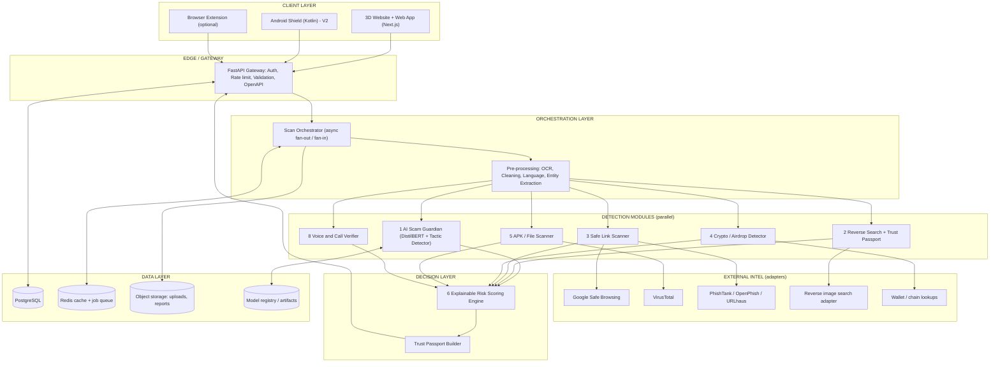
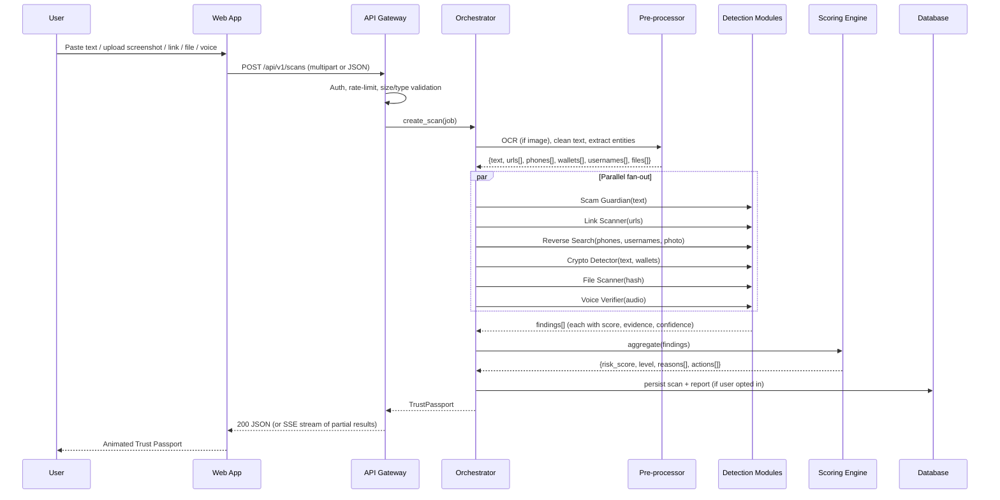
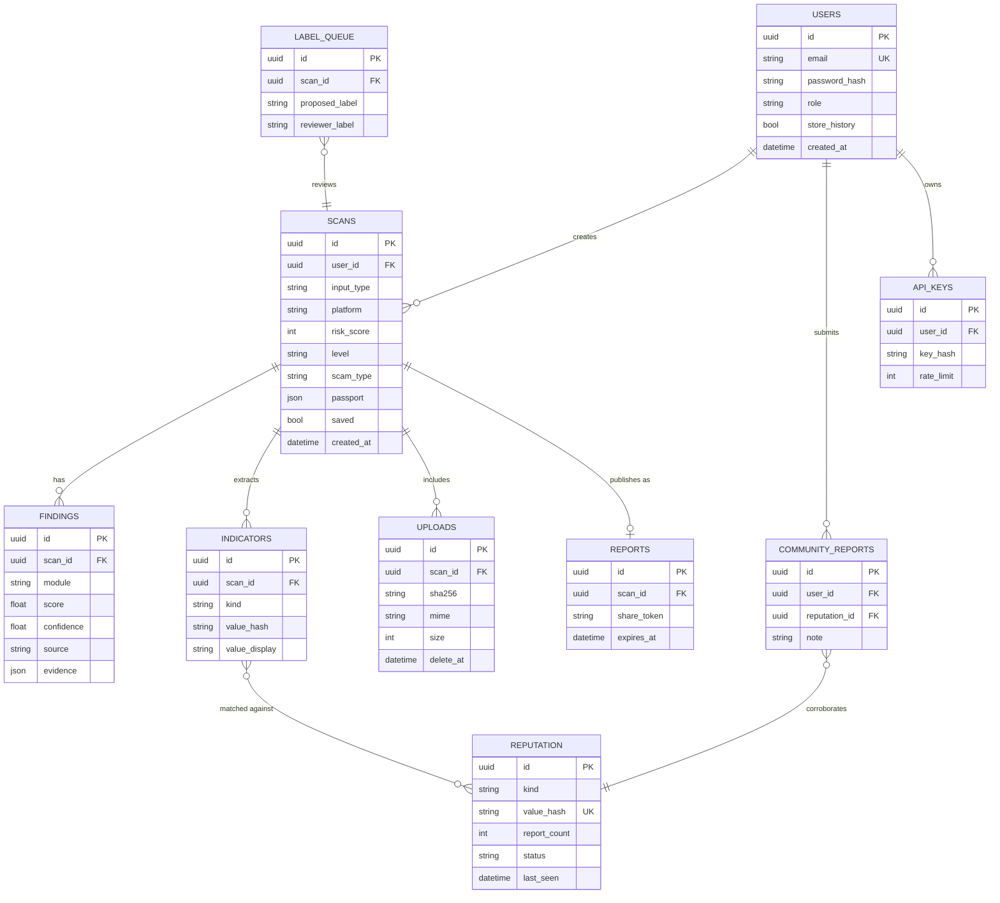

# ScamShield AI — Master Build Blueprint (for Google Antigravity)

> **How to use this file:** Put this file in the root of an empty project folder as `BLUEPRINT.md`, open the folder in Antigravity, and paste the prompt from **Section 20** into the Agent Manager. The agent should read this whole file first, produce a plan/Artifact for each phase, and build phase by phase (Section 17). Do not let it skip phases.

---

## 0. Mission Brief

Build **ScamShield AI**, a full-stack, production-style web platform (plus an Android companion) that detects and explains scams on **Facebook** (Messenger, Marketplace, profiles) and **Telegram** (channels, groups, DMs).

A user pastes a message, uploads a screenshot, or submits a link / profile / phone number / wallet address / file / voice note. The system runs several detection modules in parallel, merges their results into one **Explainable Risk Score**, and returns a **Trust Passport** report: risk level, the exact reasons, extracted indicators (URLs, wallets, numbers), and a recommended action.

**Two deliverables, equal priority:**
1. **A working detection system** (backend, ML models, threat-intel integrations, database, APIs).
2. **A premium, 3D, big-company-grade marketing + product website** that is also the app's front end (Section 12).

**Team context:** two B.Tech IT students (SNDT Women's University, Usha Mittal Institute of Technology, Semester III). The whole system must be free to run (free tiers / open source), runnable on a laptop with `docker compose up`, and easy to demo live to evaluators.

---

## 1. Ground Rules for the Agent

1. **Real, working code only.** No mock endpoints returning hard-coded results in the final product. Where an external API key is missing, use a clean adapter with a clearly-labelled *offline fallback* (see Section 7), never silent fake data.
2. **Explainability is the product.** Every score must come with machine-readable reasons. A black-box number is a bug.
3. **Privacy first.** Message text and screenshots are processed on our own server. Never log raw message content in plain text; store only what the user chooses to save (Section 13).
4. **Do not invent statistics.** On the website, use only figures with a cited source (National Cyber Crime Reporting Portal, RBI, the four research papers). Anything else must be visibly labelled "illustrative".
5. **No scraping Facebook/Telegram.** Both platforms forbid it. All inputs are **user-submitted** (paste / upload / share). Never build a crawler against them.
6. **Every module ships with:** typed interface, unit tests, an OpenAPI-documented endpoint, a sample input/output fixture, and a README section.
7. **Ask before big deviations** from this blueprint; otherwise follow it exactly.
8. Commit in small steps using the branch strategy in Section 18.

---

## 2. Scope Tiers (resolves the 7-vs-8 module difference in the docs)

The proposal lists 8 modules; the literature survey scopes Version 1 to 7 and treats Voice Verifier + Background Shield as future scope. We build **everything**, in tiers, so the demo always works:

| Tier | Modules | Status |
|---|---|---|
| **V1 — Must ship** | 1 AI Scam Guardian · 2 Reverse Search & Trust Passport · 3 Safe Link Scanner · 4 Fake Crypto/Airdrop Detector · 5 Suspicious APK/File Scanner · 6 Explainable Risk Scoring · 7 Accounts + History | Full quality |
| **V1.5 — Should ship** | 8 AI Voice & Call Verifier | Working prototype using a pretrained anti-spoofing model; shown with an honest "probabilistic" label |
| **V2 — Stretch** | 9 Real-Time Background Shield (Android Accessibility Service, sideloaded APK) · Community reporting DB | Built after V1/V1.5 are stable |

---

## 3. System Architecture (Layered)



### 3.1 Request lifecycle (sequence)



**Streaming requirement:** the API must expose Server-Sent Events (`GET /api/v1/scans/{id}/stream`) so the frontend can animate each module's result arriving live (this is the "wow" moment on the 3D site).

---

## 4. Module Relationship & Branch Map

```
ScamShield AI
│
├── INPUT BRANCHES ──────────────┐
│   ├── Text message             │
│   ├── Screenshot ──► OCR ──────┤
│   ├── Profile link / username  │
│   ├── Phone number             │
│   ├── URL                      ├──► PRE-PROCESSOR ──► Entity Extractor
│   ├── Wallet address           │        (urls, phones, wallets, handles, amounts, files)
│   ├── File / APK               │
│   └── Voice note / recording ──┘
│
├── DETECTION BRANCHES (each is an independent service class)
│   ├── [1] Scam Guardian ........ needs: text
│   │        ├── Scam-type classifier (multi-class)
│   │        ├── Manipulation-tactic detector (multi-label)
│   │        └── Token attribution (highlighted words)
│   ├── [2] Reverse Search ....... needs: phone | username | photo | url
│   │        ├── Phone intelligence
│   │        ├── Username / profile heuristics
│   │        ├── Photo reverse-search adapter
│   │        └── Community reputation lookup
│   ├── [3] Link Scanner ......... needs: url
│   │        ├── Canonicalise + unshorten
│   │        ├── Google Safe Browsing / PhishTank / URLhaus
│   │        └── Lexical + domain-age + homoglyph heuristics
│   ├── [4] Crypto/Airdrop ....... needs: text | wallets | urls
│   │        ├── Wallet extractor + checksum validation
│   │        ├── Investment-scam language model
│   │        └── Known-scam wallet / domain lookup
│   ├── [5] File Scanner ......... needs: file
│   │        ├── SHA-256 → VirusTotal hash lookup
│   │        └── APK static analysis (permissions, manifest)
│   └── [8] Voice Verifier ....... needs: audio
│            ├── Anti-spoof (deepfake) classifier
│            └── Transcript → fed back into Scam Guardian
│
├── DECISION BRANCH
│   └── [6] Explainable Risk Scoring
│            ├── Weighted evidence fusion
│            ├── Hard-rule overrides (e.g. GSB confirmed phishing = HIGH)
│            ├── Reason generator (plain language, EN + Hindi)
│            └── Recommended actions (block, report, do-not-pay, call 1930)
│
├── OUTPUT BRANCH
│   └── Trust Passport (JSON → web UI → shareable PDF)
│
└── PLATFORM BRANCHES
    ├── [7] Accounts, history, saved reports
    ├── Admin console (label review, model metrics, abuse reports)
    └── [9] Android Shield (V2)
```

**Dependency rules**
- Detection modules never call each other. Only the orchestrator connects them (this keeps every module testable in isolation).
- Voice Verifier outputs a transcript that the orchestrator feeds back into Scam Guardian (one allowed second-pass).
- Scoring engine only reads module outputs. It never calls external APIs.

---

## 5. Monorepo Structure

```
scamshield-ai/
├── BLUEPRINT.md
├── README.md
├── docker-compose.yml
├── .env.example
├── Makefile
├── .github/workflows/ci.yml
│
├── apps/
│   ├── web/                       # Next.js 15 (App Router) - the 3D site + app
│   │   ├── app/
│   │   │   ├── (marketing)/       # home, product, modules, how-it-works, research, about, contact
│   │   │   ├── (app)/             # scan, history, report/[id], passport, settings
│   │   │   ├── (auth)/            # login, signup
│   │   │   └── admin/             # labels, metrics, reports
│   │   ├── components/
│   │   │   ├── three/             # R3F scenes (Hero, Pipeline, ShieldCore)
│   │   │   ├── ui/                # design-system components
│   │   │   └── passport/          # Trust Passport views
│   │   ├── lib/                   # api client, sse hook, i18n
│   │   └── public/models/         # compressed .glb assets
│   │
│   ├── api/                       # FastAPI backend
│   │   └── app/
│   │       ├── main.py
│   │       ├── core/              # config, security, logging, rate limit
│   │       ├── api/v1/            # routers: scans, auth, history, reports, admin, health
│   │       ├── orchestrator/      # fan-out/fan-in, job state, SSE
│   │       ├── preprocess/        # ocr.py, clean.py, entities.py, lang.py
│   │       ├── modules/
│   │       │   ├── scam_guardian/
│   │       │   ├── reverse_search/
│   │       │   ├── link_scanner/
│   │       │   ├── crypto_detector/
│   │       │   ├── file_scanner/
│   │       │   └── voice_verifier/
│   │       ├── scoring/           # fusion.py, rules.py, reasons.py, passport.py
│   │       ├── intel/             # adapters: gsb.py, virustotal.py, phishtank.py, urlhaus.py, image_search.py
│   │       ├── db/                # models.py, session.py, migrations (Alembic)
│   │       └── schemas/           # Pydantic models (shared contracts)
│   │
│   └── android-shield/            # Kotlin + Jetpack Compose (V2)
│
├── ml/
│   ├── data/                      # raw/, interim/, processed/, labels_schema.md
│   ├── notebooks/                 # EDA, training, error analysis
│   ├── training/                  # train_scam_type.py, train_tactics.py, baseline_svm.py
│   ├── eval/                      # metrics, confusion matrices, ablations
│   └── artifacts/                 # exported models (git-ignored, DVC or release assets)
│
├── packages/
│   └── contracts/                 # OpenAPI spec + generated TS client
│
├── datasets/                      # curated fixtures & demo scenarios (synthetic only)
│   └── demo_scenarios/            # 6 demo JSON/media packs (Section 16)
│
├── docs/
│   ├── architecture.md · api.md · ml-report.md · testing-report.md
│   ├── threat-model.md · privacy.md · user-guide.md
│   └── diagrams/                  # exported mermaid PNG/SVG
│
└── tests/
    ├── unit/ · integration/ · e2e/ (Playwright) · load/ (k6 or Locust)
```

---

## 6. Technology Stack (all free / open source)

| Layer | Choice | Reason (from the literature survey where applicable) |
|---|---|---|
| Frontend | **Next.js 15, React 19, TypeScript, Tailwind CSS** | SSR/SEO for a company-style site |
| 3D | **Three.js via React Three Fiber + drei**, **GSAP ScrollTrigger**, **Lenis** (smooth scroll), Framer Motion (UI micro-interactions) | Scroll-driven cinematic 3D |
| Backend | **FastAPI (async)**, Pydantic v2, SQLAlchemy 2, Alembic | Survey §5.4: async, auto OpenAPI, ML serving |
| Queue / cache | **Redis** + **ARQ** (or Celery) | Async jobs, caching threat-intel lookups |
| DB | **PostgreSQL** (SQLite allowed for quick local dev) | Relational history, audit |
| NLP | **HuggingFace Transformers, PyTorch, scikit-learn** | Fine-tuned **DistilBERT** primary, SVM/Naive Bayes baseline (Survey §5.1) |
| Explainability | **Captum / SHAP / attention attribution** + rule-based tactic matcher | Word-level highlights |
| OCR | **Tesseract** (`pytesseract`, English + Hindi + Marathi traineddata), OpenCV preprocessing | Survey §5.2: free, private |
| URL intel | **Google Safe Browsing v5/v4 Lookup**, PhishTank *(if API access is available)*, **URLhaus** and **OpenPhish** as free backups | Survey §4.2, §4.4 |
| File intel | **VirusTotal API v3** (hash lookup first, upload only if user consents) + `androguard` for APK manifest analysis | Survey §4.3 |
| Phone | `phonenumbers` (libphonenumber) | Region, type, validity |
| Voice | `librosa`, `torchaudio`, pretrained open **anti-spoofing** model (AASIST or wav2vec2-based, ASVspoof-trained) + Whisper (small/tiny) for transcripts | Deepfake voice artefacts |
| Auth | JWT (access + refresh), Argon2 password hashing, optional Google OAuth | |
| Deploy | Docker Compose locally; Vercel (web) + Render/Railway/Fly (api) if hosting | |
| CI | GitHub Actions: lint, type-check, tests, build | |
| Testing | Pytest, Playwright, Vitest, Lighthouse CI | |

---

## 7. Detection Module Specifications

Every module implements the same interface so the orchestrator can treat them uniformly:

```python
class Finding(BaseModel):
    module: str                 # "scam_guardian", "link_scanner", ...
    score: float                # 0.0 (safe) .. 1.0 (certain scam)
    confidence: float           # how much to trust this score
    verdict: Literal["safe","suspicious","dangerous","unknown"]
    evidence: list[Evidence]    # concrete, displayable reasons
    indicators: dict            # extracted urls, wallets, phones...
    source: Literal["model","rule","external_api","offline_fallback"]
    latency_ms: int

class DetectionModule(Protocol):
    name: str
    async def analyze(self, ctx: ScanContext) -> Finding: ...
```

### 7.1 Module 1 — AI Scam Guardian
**Input:** cleaned text (typed, OCR output, or voice transcript).
**Outputs:** (a) scam type, (b) manipulation tactics, (c) highlighted spans.

- **Scam-type classes (multi-class):** `legit`, `marketplace_advance_payment`, `fake_buyer_overpay_refund`, `romance_impersonation`, `cloned_friend_account`, `fake_job_task`, `investment_crypto`, `airdrop_giveaway`, `lottery_prize`, `kyc_bank_upi`, `phishing_link_lure`, `tech_support_impersonation`, `loan_app_harassment`, `other_suspicious`.
- **Manipulation tactics (multi-label):** `urgency`, `fake_authority`, `advance_payment_request`, `off_platform_move` (e.g. "text me on Telegram/WhatsApp"), `too_good_to_be_true`, `secrecy_isolation`, `emotional_pressure`, `impersonation_of_known_person`, `credential_request` (OTP/PIN/CVV), `threat_or_fear` (arrest, account block).
- **Model:** fine-tuned **DistilBERT-multilingual** (handles English, Hinglish, Hindi/Marathi transliteration) with a classification head + a multi-label head. Baseline: TF-IDF + linear SVM / Naive Bayes retained as fast fallback and comparison (Survey §5.1).
- **Informal text handling** (Survey paper [3]): normalise emojis to text tokens, expand common abbreviations, keep obfuscation signals (e.g. `w.h.a.t.s.a.p.p`, `Ｇｉｖｅａｗａｙ`) as *features*, not noise.
- **Explainability:** token attribution (Captum integrated gradients or SHAP) returns top spans, plus a rule-based tactic matcher (regex + keyword lexicons in EN/HI) whose matches are unioned with model tactics. UI highlights those spans inline.
- **Performance target:** < 400 ms on CPU for a 300-token message; macro-F1 ≥ 0.85 on the held-out test set (report honestly if lower).

### 7.2 Module 2 — Reverse Search & Trust Passport
**Input:** any of phone number, username / profile URL, profile photo, listing URL.
Sub-checks (each returns its own evidence row in the passport):
1. **Phone intelligence:** parse with `phonenumbers` (validity, country, line type, carrier region). Flag mismatch, e.g. a "local Mumbai seller" with a +234 or VoIP number.
2. **Username / profile heuristics:** handle patterns (random digits, look-alike of a known brand), impersonation similarity vs. an optional "who is this person claiming to be?" field (Levenshtein + homoglyph normalisation).
3. **Photo reverse search:** perceptual hash (pHash/dHash) against (a) our own scam-photo table, (b) a pluggable `ReverseImageAdapter`. Provide **two implementations**: `SerpApiLensAdapter` (free tier / optional key) and `DeepLinkFallbackAdapter` (generates ready-to-open Google Lens / TinEye / Yandex search links for the user). *Do not assume any free official Google reverse-image API exists.*
4. **Community reputation:** lookup in our `reports` table (number/handle/wallet/URL seen in prior scans, with corroboration count).
5. **Listing sanity (Marketplace):** price-vs-category heuristics, "advance payment only", stock-photo detection via pHash reuse.

**Trust Passport composition:** overall trust score (0–100), per-check status (pass / warn / fail / not-checked), confidence, and the data sources used. Never show "verified" — only "no red flags found in the checks run".

### 7.3 Module 3 — Safe Link Scanner
Pipeline: extract URLs → **canonicalise** (lower-case host, strip tracking params, punycode decode) → **unshorten** with a safe HEAD/GET (timeout, max 5 redirects, block private IP ranges to prevent SSRF) → parallel checks:
- **Google Safe Browsing** (hash-prefix design, Survey §4.2); cache results in Redis (TTL per API guidance).
- **PhishTank** (if key available) / **URLhaus** / **OpenPhish** feed lookups.
- **Heuristics:** domain age (WHOIS/RDAP), TLD risk, homoglyph/brand-lookalike (e.g. `paytm-kyc-update.xyz`), excessive subdomains, IP-literal hosts, `@` tricks, punycode, URL length, HTTP-only, login-form-on-unknown-domain (fetch HTML in a sandboxed, no-JS, size-capped request).
- **Never render or execute** remote content on the server beyond the capped HTML fetch.
- Offline fallback: heuristics only, labelled `offline_fallback` and confidence capped at 0.5.

### 7.4 Module 4 — Fake Crypto / Airdrop Detector (Telegram focus)
Design pattern from paper [4]: **NLP label + structured artefacts**, not a bare verdict.
- **Extract:** wallet addresses (BTC bech32/base58, ETH/EVM 0x + EIP-55 checksum, TRON `T…` base58check, SOL base58), Telegram invite links (`t.me/+…`, `t.me/joinchat`), `@usernames`, claimed returns ("2x in 24h", "guaranteed 30% weekly"), "connect wallet / seed phrase / private key" requests.
- **Classify:** investment/airdrop/giveaway language using Module 1's `investment_crypto` + `airdrop_giveaway` heads plus dedicated rules (guaranteed returns, VIP signals group, admin-DM-me, pay-gas-fee-to-claim).
- **Hard red flags (instant HIGH):** any request for seed phrase / private key; "send X to receive 2X"; wallet found in our known-scam table.
- **Lookups:** local scam-wallet table; optional public scam-report lookups behind an adapter (only if the API terms allow).
- **Output:** list of wallets/links found, each with checksum validity and reputation status.

### 7.5 Module 5 — Suspicious APK / File Scanner
- Compute **SHA-256** client-side or server-side → **VirusTotal hash lookup** (no upload by default; ask explicit consent before uploading unknown files, since uploads become public to VT customers).
- **APK static analysis** via `androguard`: dangerous permission combos (`BIND_ACCESSIBILITY_SERVICE`, `READ_SMS` + `INTERNET`, `SYSTEM_ALERT_WINDOW`, `REQUEST_INSTALL_PACKAGES`), unsigned / debug-signed, package-name impersonation (`com.sbi.yono.update`), obfuscation indicators, hard-coded IPs/URLs/Telegram bot tokens.
- Size/type validation, magic-byte check (not extension), quarantine folder, files auto-deleted after 24 h (configurable).
- **Never execute** uploaded files. Run analysis in a low-privilege container.

### 7.6 Module 8 — AI Voice & Call Verifier (V1.5)
- Accept `.wav/.mp3/.m4a/.ogg` (Telegram voice notes are `.ogg` Opus), ≤ 10 MB, ≤ 2 min.
- Resample to 16 kHz mono → anti-spoofing model → **spoof probability** + spectral evidence (e.g. band-limited artefacts, unnatural pitch contour) shown as a spectrogram in the UI.
- Whisper transcript → sent to Module 1 for scam-script analysis (deepfake + scam wording together is far stronger evidence).
- **Honesty requirement:** UI must state this is probabilistic, can be wrong on noisy/compressed audio, and report accuracy on our test clips in `docs/ml-report.md`.

### 7.7 Module 9 — Real-Time Background Shield (V2, Android)
- Kotlin + Compose app with an **AccessibilityService** (explicit consent screen, plain-language explanation, easy off switch).
- Watches text on screen only inside Telegram/Facebook/Messenger packages; extracts URLs and message text locally; sends only hashed URLs (privacy) or user-approved text to `/api/v1/scans/quick`.
- Shows an overlay warning ("Risky link — reason: …") + "Open ScamShield" button.
- On-device first: small URL heuristics offline; call server only if needed.
- **Note for docs:** Google Play restricts Accessibility use, so distribute as a sideloaded APK for the academic demo. State this openly.
- If time is short, ship a **browser extension** for Telegram Web / Facebook web with the same warning overlay instead, and keep Android as a documented design.

---

## 8. Module 6 — Explainable Risk Scoring Engine

### 8.1 Fusion formula
```
For each finding i: contribution_i = score_i * confidence_i * weight_i
risk_raw   = 1 - Π (1 - contribution_i)        # noisy-OR: independent evidence compounds
risk_score = round(100 * risk_raw)
```
Default weights (config file, tunable, calibrated on validation set):

| Module | Weight |
|---|---|
| link_scanner (confirmed by GSB/PhishTank) | 1.00 |
| file_scanner (VT ≥ 5 engines) | 1.00 |
| crypto_detector (seed-phrase request / known wallet) | 1.00 |
| scam_guardian | 0.85 |
| voice_verifier | 0.70 |
| reverse_search | 0.60 |

### 8.2 Hard-rule overrides (applied after fusion)
- Confirmed phishing/malware from an external authority → `risk_score = max(score, 90)`.
- Seed phrase / private key / OTP request → `max(score, 85)`.
- Only `unknown` findings (all APIs down) → level `INCONCLUSIVE`, never "safe".

### 8.3 Levels
`0–24 LOW` · `25–49 CAUTION` · `50–74 HIGH` · `75–100 CRITICAL` · plus `INCONCLUSIVE`.

### 8.4 Reason generator
Each `Evidence` carries: `code` (e.g. `URGENCY_LANGUAGE`), `severity`, `title`, `plain_text`, `source`, and optional `span` (start/end offsets for highlighting). The engine sorts by severity, dedupes, and renders **3–6 reasons** in plain English (and Hindi via a translation table for fixed reason codes — no LLM needed).

**Example reasons**
- "The message pressures you to act within 10 minutes (urgency)."
- "The seller asks you to pay in advance and move to Telegram (off-platform payment)."
- "The link `sbi-kyc-update.xyz` is 3 days old and mimics a bank (look-alike domain)."
- "The wallet address in this message is reported in our scam database (2 reports)."

### 8.5 Recommended actions (per scam type)
Do-not-pay / do-not-click / block-and-report inside the platform / preserve evidence (screenshot) / **call 1930 or report at cybercrime.gov.in if money was lost** (the agent must verify the current helpline number and portal URL before hard-coding, and keep them in one config file).

### 8.6 Trust Passport JSON (contract)
```json
{
  "scan_id": "uuid",
  "risk_score": 87,
  "level": "CRITICAL",
  "confidence": 0.91,
  "scam_type": "investment_crypto",
  "reasons": [
    {"code":"GUARANTEED_RETURNS","severity":"high","text":"...","span":[12,48]}
  ],
  "modules": [
    {"name":"scam_guardian","status":"done","score":0.93,"source":"model"},
    {"name":"link_scanner","status":"done","score":1.0,"source":"external_api"}
  ],
  "indicators": {"urls":[],"wallets":[],"phones":[],"usernames":[]},
  "actions": ["Do not send funds","Leave the group","Report to cybercrime.gov.in"],
  "disclaimer": "ScamShield gives risk guidance, not legal or financial advice.",
  "created_at": "ISO-8601"
}
```

---

## 9. Database Design



Rules: indicators are stored as **salted hashes** for lookup plus a truncated display value; raw text is stored only when `store_history = true` and encrypted at rest (application-level, e.g. Fernet); uploads have a `delete_at` TTL.

---

## 10. API Contract (versioned, OpenAPI auto-generated)

| Method & path | Purpose |
|---|---|
| `POST /api/v1/scans` | Create a scan (JSON text/url/phone/wallet or multipart image/file/audio) → returns `scan_id` |
| `GET  /api/v1/scans/{id}` | Full Trust Passport |
| `GET  /api/v1/scans/{id}/stream` | **SSE**: per-module progress + partial findings |
| `POST /api/v1/scans/quick` | Lightweight check for the extension / Android Shield (URL hashes, short text) |
| `GET  /api/v1/history` | Paginated user history |
| `DELETE /api/v1/history/{id}` | Delete a scan and its stored content |
| `POST /api/v1/reports/{scan_id}/share` | Create expiring share link / export PDF |
| `POST /api/v1/community/report` | Report a number/handle/wallet/URL |
| `POST /api/v1/auth/signup · login · refresh · logout` | Auth |
| `GET  /api/v1/health · /ready` | Liveness / readiness (includes intel-adapter status) |
| `GET  /api/v1/admin/metrics · /labels · /models` | Admin only |

Global requirements: request-size limits, per-IP + per-user rate limits (Redis), consistent error schema, correlation IDs in logs, CORS allow-list, a generated TypeScript client in `packages/contracts`.

---

## 11. ML Plan (dataset → model → evaluation)

### 11.1 Data sources
1. Public scam/spam corpora (e.g. SMS Spam Collection, the "Super SMS Spam" style consolidated sets referenced in paper [1], phishing-URL datasets, ASVspoof-style voice data where licences allow).
2. **Synthetic Facebook/Telegram-style scam messages** written by the team, in English, Hinglish and Hindi/Marathi: Marketplace advance payment, fake buyer overpay/refund, cloned-friend "urgent money", romance, fake job/"like & earn tasks", crypto signal groups, airdrop/gift, KYC/UPI, digital-arrest threats.
3. **Hard negatives** (very important): genuine sellers asking for a deposit, real bank alerts, friends asking for help, legit crypto discussions, real job offers.
4. Only synthetic or fully anonymised content. **No real people's chats.** Strip names/numbers with a scrubber in `ml/data/`.

Target: ≥ 4,000 labelled text samples (≥ 250 per scam class, ≥ 1,500 legit incl. hard negatives), ≥ 60 screenshots for OCR tests, ≥ 30 audio clips (real vs. consented-voice clones), ≥ 40 APK/benign samples (use public malware-research corpora only inside an isolated VM and never redistribute).

### 11.2 Labelling schema
Documented in `ml/data/labels_schema.md`: one primary `scam_type`, multi-label `tactics`, `platform` (facebook/telegram/other), `language`, `source` (synthetic/public), `split`. Two team members label a 10% overlap and report Cohen's kappa.

### 11.3 Training
- Splits: 70/15/15 stratified, and a **temporal or template-disjoint test set** (no template leakage — paper [1]'s recency lesson).
- Baselines: majority class → TF-IDF + Naive Bayes → TF-IDF + linear SVM → **DistilBERT-multilingual** (final).
- Handle imbalance (class weights), early stopping, seeded runs.
- Export ONNX (or TorchScript) for fast CPU serving; version models in `ml/artifacts/vX.Y/` with a `model_card.md`.

### 11.4 Evaluation (write into `docs/ml-report.md`)
Macro-F1, per-class precision/recall, confusion matrix, false-positive rate on hard negatives (**the number that matters most for user trust**), calibration (reliability diagram; temperature scaling), latency, ablation (with/without tactic rules, with/without OCR noise augmentation), error analysis with 20 real failure cases, and a candid limitations section.

### 11.5 Continuous improvement loop
Admin "label queue" → reviewer confirms/corrects flagged scans (only for users who opted in) → monthly retrain script. Document this, and implement at least the queue + export.

---

## 12. The 3D Website — "Big-Company" Grade Front End

### 12.1 Concept: *the shield that reads the message*
Not a template. The site's single memorable idea is a **3D shield core built from translucent layered plates** (the layers of defence: OCR → NLP → reverse search → link/file/crypto/voice → scoring). Message fragments (chat bubbles, links, wallet strings) drift toward it. **Scam fragments are intercepted, pulse coral, and split open to show why; safe ones pass through in mint.** Everything else on the site stays calm and disciplined so this one idea lands.

**The hero is a live demo:** a large input ("Paste a message, link or number") sits in front of the 3D scene. When the visitor scans, the shield reacts in real time (plates light up in sequence as SSE events arrive, then the result card unfolds). No stock illustration, no generic gradient-blob hero.

### 12.2 Design tokens (starting proposal; agent must review and may refine, but must not fall back to generic defaults)

| Token | Value | Use |
|---|---|---|
| `--ink` | `#0F1633` | Dark sections, text on light (navy, not pure black) |
| `--paper` | `#F3F5FA` | Light sections background |
| `--ultramarine` | `#2F45FF` | Primary actions, shield plates |
| `--signal` | `#FF5B4A` | Danger / scam intercepted |
| `--verify` | `#1FB58F` | Safe / passed |
| `--caution` | `#F5A524` | Warnings |

- **Type:** display **Bricolage Grotesque** (headings, big numerals); body **Inter Tight** or **Public Sans**; **JetBrains Mono** *only* for machine data (URLs, wallets, hashes, phone numbers); **Noto Sans Devanagari** for Hindi/Marathi. Line length < 75 chars. Sentence case everywhere.
- **Colour is never the only signal:** pair every risk colour with an icon and a label.
- **Themes:** light + dark, driven by tokens, respecting `prefers-color-scheme`.
- **Copy voice:** plain, active, user-first ("Check a message", not "Initiate analysis"). Errors say what failed and what to do next.
- **Avoid (explicit):** eyebrow labels in tracked ALL-CAPS above every heading, a single accented word in each headline, identical rounded cards everywhere, fade-up-on-every-section, numbered 01/02/03 markers unless it's a real sequence (the pipeline *is* a sequence, so numbering is allowed there only), near-black + acid-green "hacker" look, stock cyber-padlock imagery.

### 12.3 Motion principles
- **One orchestrated moment:** the scroll-pinned pipeline (storyboard item 3 in 12.5). Everything else uses minimal, purposeful motion.
- Motion that answers user action (expand a reason, submit a scan, reveal evidence) is welcome.
- **Lenis** smooth scroll + **GSAP ScrollTrigger** driving the R3F camera and plate positions via a shared scroll progress value.
- Respect `prefers-reduced-motion`: disable scroll-jacking, show static poster of each scene, keep functionality intact.

### 12.4 Sitemap

```
/                          Home (marketing)
/product                   Overview of the platform
/modules                   8 module deep-dives (/modules/[slug])
/how-it-works              Pipeline + architecture explained
/research                  Literature review, dataset, model card, metrics
/learn                     Scam awareness library + "spot the scam" quiz (EN/HI/MR)
/safety                    Privacy, security, data handling
/docs                      API docs (embedded OpenAPI) + user guide
/about                     Team, institution, roadmap
/contact                   Contact / report a bug
/scan                      APP: run a scan (all input types)
/report/[id]               APP: Trust Passport view
/history                   APP: past scans
/settings                  APP: language, privacy, delete data
/login  /signup            Auth
/admin                     Admin: label queue, model metrics, abuse reports
/status                    Live health of modules & intel adapters
```

### 12.5 Home page storyboard (top to bottom)

1. **Hero (3D + live input).** Headline states the job in plain words: *"Know if it's a scam before you reply."* Sub-line: *"Paste a Facebook or Telegram message, link, profile or file. ScamShield shows you exactly why it's risky."* Platform chips (Facebook, Telegram). The shield core rotates slowly; pointer parallax; result state animates the plates.
2. **The problem, with sources.** Three verified data points from cybercrime.gov.in / RBI (agent must fetch and cite real, current figures with links; otherwise leave clearly-marked placeholders). Short, plain paragraph on how scammers move victims from Facebook to Telegram.
3. **How it works (the orchestrated 3D moment).** Section pins; the camera travels along the pipeline through 6 stations as the user scrolls: *Message in → Read (OCR + cleaning) → Understand (NLP) → Verify (reverse search, links, files, crypto, voice) → Score → Trust Passport.* Each station shows a small live snippet of real module output from the demo fixtures. This is a true sequence, so numbering is appropriate here.
4. **Modules.** Bento layout with **varied sizes** (not identical cards): Scam Guardian (large, shows highlighted message), Link Scanner (URL being unwrapped), Crypto/Airdrop (wallet extraction), File/APK (permissions list), Reverse Search (photo match), Voice (spectrogram), Background Shield (phone overlay mock). Hover/tap opens the module's page.
5. **Trust Passport.** Interactive sample passport: click a reason → the original message text highlights the responsible words. Toggle *Facebook Marketplace / Telegram crypto / Cloned friend*.
6. **Real scenarios.** Tabbed walk-through of the 6 demo scenarios (Section 16) with before/after.
7. **Why it's different.** Honest comparison table taken from the literature survey (Truecaller, Google Safe Browsing, VirusTotal, PhishTank vs ScamShield). Include limitations, not just strengths.
8. **Research & method.** Papers reviewed, dataset size, model, **real measured metrics** from `docs/ml-report.md`. Link to the model card.
9. **Privacy by design.** What is stored, what is not, how to delete everything. Screenshots processed on our own server; only URL hash prefixes go to Google Safe Browsing.
10. **Roadmap.** Android Shield, more platforms (Instagram, X, WhatsApp, SMS, email), iOS Safari extension, community reports.
11. **Team & institution.** Shrushti Dayma, Chanchal Jadhav, SNDT Women's University, Usha Mittal Institute of Technology.
12. **Closing CTA + footer.** Footer with sitemap, language switcher, GitHub link, "Report a scam" quick links (cybercrime.gov.in — agent to verify URL/helpline), disclaimer.

### 12.6 3D scene specifications

| Scene | Contents | Tech notes |
|---|---|---|
| **HeroShield** | Layered shield (5–6 extruded plates, `MeshPhysicalMaterial` with transmission/thickness on desktop), inner glowing core, ~150 instanced message fragments orbiting/streaming in, coral/mint state changes | `@react-three/fiber`, `drei` (`Environment`, `Float`, `Text3D` optional), tiny bloom via `@react-three/postprocessing` |
| **PipelineTrack** | A curved track with 6 stations; camera on a `CatmullRomCurve3`; fragment travels the track and mutates (text → tokens → flags → score ring) | Driven by ScrollTrigger progress; DOM overlays for captions (real text, not in canvas, for accessibility/SEO) |
| **ModuleTiles** | Light 3D tilt on bento tiles (CSS 3D transforms or small R3F canvases only when in view) | Do NOT create 8 simultaneous WebGL contexts; use one shared canvas or CSS transforms |
| **PassportReveal** | Passport card unfolds in 3D as result arrives | CSS 3D / Framer Motion is enough |
| **Shield loader / 404** | Small reusable shield mesh | Reuse geometry |

**Asset strategy:** prefer procedural geometry (no download). If any `.glb` is used, Draco-compress it, keep it ≤ 1.5 MB, self-host it, and self-host the environment HDR (no third-party CDN dependencies at runtime).

### 12.7 App UI requirements
- **Scan page:** one clear input area with tabs: *Message · Screenshot · Link · Profile / Phone · Wallet · File · Voice*. Platform selector (Facebook / Telegram / Not sure). Drag-and-drop + paste-from-clipboard + mobile camera/gallery picker. Progress shown as the pipeline stations lighting up via SSE.
- **Trust Passport view:** large risk gauge (number + level + icon), scam type, **reasons list with inline highlight sync**, indicator table (mono font, copy buttons, *defang* toggle for URLs), per-module status strip with "not checked" states, recommended actions as a checklist, buttons: *Save*, *Export PDF*, *Share link*, *Report to community*, *Delete this scan*.
- **History:** searchable/filterable list, bulk delete, "delete all my data".
- **Empty/error states** give a next action ("Upload a clearer screenshot; text was hard to read").
- **Languages:** English, Hindi, Marathi for UI strings and fixed reason codes (i18n via `next-intl`).

### 12.8 Performance, accessibility, SEO (hard requirements)
- Lighthouse (desktop): Performance ≥ 90, Accessibility ≥ 95, Best Practices ≥ 95, SEO ≥ 95. Mobile Performance ≥ 75 with the simplified scene.
- LCP < 2.5 s (render a static poster of the hero first, hydrate 3D after), CLS < 0.1, INP < 200 ms.
- 3D chunk lazy-loaded (`next/dynamic`, `ssr: false`), DPR clamped `[1, 1.75]`, `PerformanceMonitor` to degrade quality automatically, pause rendering when off-screen or tab hidden.
- **Mobile / low-power / no-WebGL fallback:** fewer particles, no transmission material, or a pre-rendered poster/video loop; site remains fully usable.
- WCAG 2.2 AA: keyboard operable, visible focus, skip link, ARIA live region announcing scan results, sufficient contrast in both themes, captions/text alternatives for all animated content, no seizure-risk flashing.
- SEO: metadata + Open Graph images, semantic HTML, sitemap.xml, robots.txt, JSON-LD (`SoftwareApplication`, `Organization`).

---

## 13. Security & Privacy Requirements

**Threat model highlights** (write `docs/threat-model.md`):
- **SSRF** via URL unshortener → resolve DNS, block private/link-local/metadata IPs, cap redirects/size/time, no cookies.
- **Malicious uploads** → magic-byte validation, size caps, low-privilege sandbox container, never execute, TTL deletion.
- **Prompt/ReDoS/oversized input** → input length limits, timeouts on regex, request-size caps.
- **XSS** when displaying scam text → always escape; render suspicious URLs as inert, defanged text.
- **Abuse of the tool** (scanning others' private data, harvesting) → auth + rate limits, no bulk endpoints for anonymous users.
- **Secrets** → `.env` only, never committed; secret scanning in CI.
- **Auth** → Argon2, JWT rotation, HttpOnly SameSite cookies for web, CSRF protection.
- **Transport/headers** → HTTPS, HSTS, CSP, X-Content-Type-Options, Referrer-Policy.

**Privacy:** anonymous scans are not stored by default; storing history is opt-in; one-click delete; documented retention; no analytics that fingerprint users; India's DPDP Act considerations noted in `docs/privacy.md` (student-project level, not legal advice). A visible disclaimer that ScamShield provides risk guidance, may be wrong, and is not a substitute for reporting to authorities.

---

## 14. Testing Strategy

| Level | What | Tooling | Gate |
|---|---|---|---|
| Unit | Each module with fixtures; entity extractors (URLs, wallets w/ checksum, phones); scoring fusion math; reason generator | Pytest, Vitest | ≥ 80% coverage on `modules/` + `scoring/` |
| Contract | OpenAPI ↔ TS client stays in sync | schemathesis / openapi-typescript | CI fails on drift |
| Integration | Orchestrator with **mocked** intel adapters (success, timeout, 429, malformed) | Pytest + respx | Every failure mode returns a valid passport |
| ML | Held-out metrics, hard-negative FPR, latency | `ml/eval` scripts | Meets targets or documented honestly |
| E2E | 6 demo scenarios, scan → passport → export | Playwright | All pass |
| Security | SSRF, upload abuse, XSS, auth bypass, rate-limit | Manual checklist + `bandit`, `pip-audit`, `npm audit` | No high issues open |
| Performance | p95 latency per scan type, concurrent users | k6 / Locust | Text scan p95 < 3 s; link scan p95 < 5 s (with warm cache) |
| Frontend | Lighthouse CI, axe-core a11y, visual snapshots for hero states | Lighthouse CI, Playwright | Thresholds in 12.8 |

Failure-mode rule: if any external API is down, the scan still completes with that module marked `not checked` and the level can be `INCONCLUSIVE`, never a false "safe".

---

## 15. DevOps

- `docker compose up` starts: `web`, `api`, `worker`, `postgres`, `redis`, `tesseract` (bundled in the api image) — with seeded demo data and a `make demo` command.
- `.env.example` documents every key: `GOOGLE_SAFE_BROWSING_KEY`, `VIRUSTOTAL_KEY`, `PHISHTANK_KEY` (optional), `SERPAPI_KEY` (optional), `JWT_SECRET`, `DATABASE_URL`, `REDIS_URL`, `ENCRYPTION_KEY`.
- Missing keys ⇒ the adapter reports `unavailable`, the UI shows "not checked", and `/status` shows which intel sources are live.
- GitHub Actions: lint (ruff, eslint), type-check (mypy, tsc), tests, build, Docker image build, Lighthouse CI on preview.
- Structured JSON logging with correlation IDs; no raw message content in logs.

---

## 16. Demo Scenarios (must all work live)

All content is synthetic or team-created; no real victims' data.

| # | Scenario | Inputs | Expected passport highlights |
|---|---|---|---|
| 1 | **Facebook Marketplace advance-payment fraud** | Screenshot of chat: "I'm in the army, transfer ₹2,000 advance, courier will pick up" | `advance_payment_request`, `fake_authority`, `urgency`; type `marketplace_advance_payment`; CRITICAL/HIGH |
| 2 | **Cloned profile / friend impersonation** | Message "Hi, new number, urgent, send ₹5,000 on this UPI" + profile photo | Photo pHash match to a known-clone sample; username look-alike; `impersonation_of_known_person` |
| 3 | **Phishing link** | "Update KYC now: paytm-kyc-verify.xyz/login" | Look-alike domain, young domain, Safe Browsing/URLhaus hit (use a known test URL); hard override ≥ 90 |
| 4 | **Telegram fake crypto/airdrop channel** | Post promising "guaranteed 3x", wallet address, "connect wallet" | Wallets extracted + checksum status; `investment_crypto`/`airdrop_giveaway`; seed-phrase override |
| 5 | **Malicious-looking APK** | A **team-built harmless test APK** requesting SMS + accessibility permissions with a bank-like package name, plus the standard **EICAR** test file for the hash-lookup path | Dangerous permission combo, package impersonation; VT hash result |
| 6 | **Deepfake voice sample** | 20-second clip cloned from a **consenting team member's** voice, with a scam-script transcript | Spoof probability + spectrogram + transcript flagged by Scam Guardian |

Plus 2 **safe controls** (a genuine seller message; a legit bank OTP notice) to show low false positives.

---

## 17. Phased Build Plan for the Agents

Run parallel workstreams after Phase 0 (Antigravity Agent Manager: one agent each): **A** Backend/orchestrator · **B** ML · **C** Web + 3D · **D** Intel adapters/infra/tests. Each phase ends with an **Artifact** (plan, screenshots, test results, recordings) for human review.

| Phase | Goal | Key tasks | Acceptance |
|---|---|---|---|
| **0. Foundation** | Skeleton + contracts | Monorepo, Docker Compose, CI, Pydantic schemas (`Finding`, `TrustPassport`), OpenAPI, design tokens, DB migrations | `docker compose up` shows web + api health; TS client generated |
| **1. Core pipeline** | End-to-end thin slice | Preprocess (OCR, cleaning, entity extraction), orchestrator, SSE, scoring fusion + reasons, **rule-based + SVM baseline** Scam Guardian | Text scan returns valid passport with reasons; unit tests green |
| **2. Detection modules** | Link, Crypto, File, Reverse Search | Adapters with caching + fallbacks, SSRF-safe unshortener, wallet checksum validators, VT hash flow, androguard analysis, phone + pHash checks | Each module has fixtures, tests, and a live demo call |
| **3. Web foundation** *(parallel from P0)* | Design system + marketing pages | Tokens, components, layouts, i18n, nav/footer, all marketing pages with real copy | Lighthouse ≥ thresholds on non-3D pages |
| **4. 3D experience** | Hero + pipeline + tiles | HeroShield, PipelineTrack, scroll orchestration, fallbacks, perf monitor | 60 fps target on mid laptop; reduced-motion + mobile fallbacks verified with screenshots |
| **5. App UI** | Scan → Passport → History → Auth | All input tabs, SSE progress animation, passport view w/ highlight sync, PDF export, admin basics | Playwright covers scenarios 1–4 |
| **6. ML fine-tune** | DistilBERT + evaluation | Dataset build, training scripts, eval report, ONNX export, swap into Guardian behind feature flag | Metrics documented; FPR on hard negatives reported |
| **7. Voice verifier** | V1.5 | Audio pipeline, anti-spoof model, spectrogram, transcript → Guardian | Scenario 6 works; limitations documented |
| **8. Hardening** | Security, perf, a11y | Threat-model fixes, rate limits, load tests, axe fixes, error/empty states | Section 14 gates met |
| **9. Shield (V2)** | Android or extension | Consent flow, on-device URL checks, overlay, quick API | Works on a physical device / Chrome demo |
| **10. Ship** | Demo + docs | Seed data, demo script, screen recordings, final report, README, `make demo` | Fresh clone → demo in < 10 min |

**Branching strategy**
```
main            protected, always demo-able, tagged releases (v0.1 … v1.0)
└── develop     integration branch
    ├── feature/foundation-contracts
    ├── feature/preprocess-ocr
    ├── feature/module-scam-guardian
    ├── feature/module-link-scanner
    ├── feature/module-crypto-detector
    ├── feature/module-file-scanner
    ├── feature/module-reverse-search
    ├── feature/module-voice-verifier
    ├── feature/scoring-engine
    ├── feature/web-design-system
    ├── feature/web-3d-hero
    ├── feature/web-3d-pipeline
    ├── feature/web-scan-app
    ├── feature/ml-training
    ├── feature/android-shield
    └── hotfix/*
```
Conventional commits (`feat:`, `fix:`, `docs:`, `test:`, `perf:`), one PR per branch, CI must pass before merge.

---

## 18. Mapping to the Proposal's Expected Deliverables

| Proposal deliverable | Where it lives |
|---|---|
| Working prototype covering all modules | `apps/web` + `apps/api` (+ `android-shield`) |
| Curated dataset (messages, files, voice) | `datasets/`, `ml/data/`, documented in `docs/ml-report.md` |
| Source code repository | This monorepo |
| Design / implementation / testing documentation | `docs/architecture.md`, `docs/api.md`, `docs/testing-report.md`, `docs/threat-model.md` |
| Live demonstration of real-world-style scenarios | Section 16 + `make demo` + recorded walkthrough |
| Literature review & research gap | `/research` page + `docs/` (import from the literature survey) |

---

## 19. Definition of Done

- [ ] Fresh clone → `cp .env.example .env && docker compose up` → working site + API
- [ ] All 6 demo scenarios + 2 safe controls pass in Playwright
- [ ] Every module has tests, docs, fixtures and an OpenAPI entry
- [ ] Every passport shows reasons; nothing is a bare score
- [ ] Missing/failed API ⇒ graceful "not checked", never a false "safe"
- [ ] Lighthouse/a11y thresholds met; reduced-motion + mobile + no-WebGL fallbacks verified
- [ ] ML report has real numbers, hard-negative FPR, and honest limitations
- [ ] No secrets in git; security checklist complete
- [ ] README with architecture diagram, setup, demo script, screenshots

---

## 20. Prompts to Paste into Antigravity

### 20.1 Master prompt (paste into Agent Manager, planning mode)

```
You are the lead engineer for ScamShield AI. Read BLUEPRINT.md in full before doing anything.

Goal: build the complete system described there — FastAPI backend with six detection
modules, an explainable risk-scoring engine, ML training pipeline, Postgres/Redis
infrastructure, and a premium 3D Next.js website that doubles as the app front end.

Working method:
1. Start with Phase 0 only. Produce an implementation-plan Artifact listing every file
   you will create, then wait for my approval.
2. After Phase 0, spawn parallel agents for workstreams A (backend), B (ML), C (web+3D),
   D (intel adapters/infra/tests). They must code against the Pydantic/OpenAPI contracts
   from Phase 0 and never change a contract without telling me.
3. Finish each phase with an Artifact: what was built, tests run and results,
   screenshots or a browser recording for anything visual, and open issues.
4. Follow the Ground Rules in Section 1 strictly: real working code, explainable output,
   privacy-first, no invented statistics, no scraping of Facebook or Telegram.
5. Use the browser agent to visually verify the website at desktop and mobile widths,
   with reduced-motion on and off, and with WebGL disabled.
6. If a required API key or dataset is missing, build the adapter with an honest offline
   fallback and tell me exactly what I need to provide.
7. Ask me before deviating from the blueprint.

Begin now with Phase 0.
```

### 20.2 Website-only prompt (paste into a separate agent focused on `apps/web`)

```
Build the front end in apps/web exactly as specified in BLUEPRINT.md Section 12.

Stack: Next.js 15 App Router, TypeScript, Tailwind, React Three Fiber + drei,
GSAP ScrollTrigger, Lenis, Framer Motion, next-intl (EN/HI/MR).

The site must feel like a top-tier technology company's product site, but with its own
identity: the concept is "the shield that reads the message". The hero is a live scan
input in front of a 3D layered-shield scene that reacts to real API results over SSE.
The scroll-pinned "How it works" pipeline is the one big orchestrated 3D moment;
everything else stays restrained.

Before writing code:
- Write a short design plan (tokens, type, layout ASCII wireframes for hero, pipeline,
  modules bento, passport) and critique it against Section 12.2's "avoid" list. Revise
  anything that looks like a generic template and say what you changed.

Then build in this order: design system and layouts → marketing pages with real copy →
HeroShield → PipelineTrack → app pages (/scan, /report/[id], /history) wired to the API
client generated from the OpenAPI spec → admin → performance/a11y pass.

Non-negotiables: procedural geometry first, one shared WebGL canvas, lazy-loaded 3D,
static poster LCP, reduced-motion / mobile / no-WebGL fallbacks, WCAG 2.2 AA,
Lighthouse targets from Section 12.8. Use only sourced statistics on the site.
Verify with the browser agent and attach screenshots at desktop, tablet and mobile.
```

### 20.3 First message to send in the chat after the agent finishes Phase 0
```
Approved. Proceed to Phase 1 (core pipeline) and, in parallel, Phase 3 (web foundation).
Report back with the Phase 1 Artifact when a text scan returns a full Trust Passport.
```

---

## 21. Known Constraints (state these honestly in the docs and the viva)

1. Facebook and Telegram don't offer public APIs for reading private chats or Marketplace data, so ScamShield is **user-initiated**. That is a design choice, not a gap to work around by scraping.
2. Free reverse-image search APIs are limited; the photo check uses our own pHash database plus optional providers and deep-link fallbacks.
3. Deepfake voice detection is probabilistic and degrades on compressed/noisy audio.
4. OCR quality drops on low-resolution or stylised screenshots (Tesseract trade-off documented in the survey).
5. The classifier is single-message, not conversation-level (paper [3]'s conversation modelling is future work).
6. The Android Accessibility Shield can't be published on Google Play under its current policies; it is a sideloaded academic prototype.
7. Dataset is far smaller than the 150k+ corpus in paper [1]; results must be reported as such.
