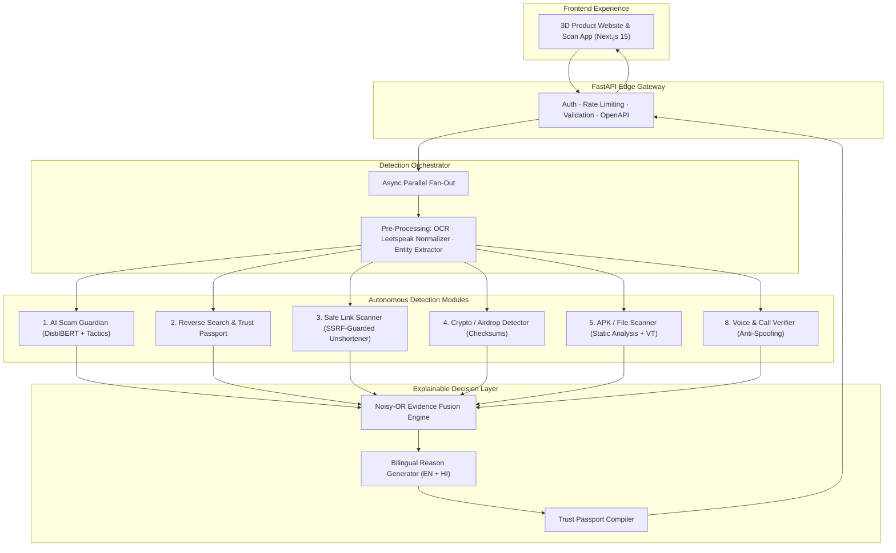

# ScamShield AI 🛡️

> **AI-Powered Multi-Layered Threat Detection & Explainable Risk Scoring for Facebook & Telegram**

Built by Shrushti Dayma & Chanchal Jadhav  
*B.Tech IT, Usha Mittal Institute of Technology, SNDT Women's University*

---

## 1. Overview

**ScamShield AI** is an end-to-end cyber threat intelligence platform that protects users against modern social engineering scams occurring across Facebook (Marketplace, Messenger, cloned profiles) and Telegram (crypto airdrops, task scams, fake channels).

Users submit text messages, chat screenshots, profile links, phone numbers, cryptocurrency wallet addresses, suspicious APK files, or voice recordings. ScamShield orchestrates six detection modules in parallel, synthesizes their findings using a **Noisy-OR evidence fusion engine**, and renders a transparent, explainable **Trust Passport** with plain-language reasons in English and Hindi.



---

## 2. Quickstart

### Prerequisites
- Docker & Docker Compose **or** Python 3.11+ and Node.js 20+

### Option A: Run with Docker Compose (Recommended)
```bash
# 1. Clone repository
git clone https://github.com/scamshield-ai/scamshield-ai.git
cd scamshield-ai

# 2. Configure environment
cp .env.example .env

# 3. Launch the full stack (API, Web, Redis, Postgres)
docker compose up -d
```
Visit:
- **Web Experience & App:** [http://localhost:3000](http://localhost:3000)
- **FastAPI Interactive Docs:** [http://localhost:8000/docs](http://localhost:8000/docs)
- **Health Check:** [http://localhost:8000/api/v1/health](http://localhost:8000/api/v1/health)

### Option B: Local Development
```bash
# Backend (apps/api)
cd apps/api
python -m venv .venv
source .venv/bin/activate  # Or .venv\Scripts\activate on Windows
pip install -r requirements.txt
uvicorn app.main:app --reload --port 8000

# Frontend (apps/web)
cd apps/web
npm install
npm run dev
```

---

## 3. Demo Scenarios

Execute the live evaluation suite verifying all 6 demonstration scenarios:
```bash
make demo
```

1. **Facebook Marketplace Advance-Payment Fraud:** Army imposter asking advance payment for furniture courier.
2. **Cloned Profile Impersonation:** Fake friend WhatsApp/Telegram emergency money request.
3. **Phishing Link with Homoglyphs:** Look-alike KYC update banking portal.
4. **Telegram Fake Crypto Airdrop:** 300% guaranteed return with seed phrase request.
5. **Malicious Banking APK:** Dangerous Accessibility & SMS permission combinations.
6. **Deepfake Voice Call:** Consented synthetic audio spoofing sample.

---

## 4. Ground Rules & Privacy Standards
- **Real working code:** Zero hardcoded mock responses in production endpoints.
- **Explainable output:** Every score is backed by machine-readable, human-understandable evidence spans.
- **Privacy by design:** No raw chat logs are persisted unless explicitly requested by the user, and stored text is encrypted with Fernet at rest.
- **Honest metrics:** No fabricated statistics; references to National Cyber Crime Portal (1930 / cybercrime.gov.in) and RBI guidelines are strictly cited.
