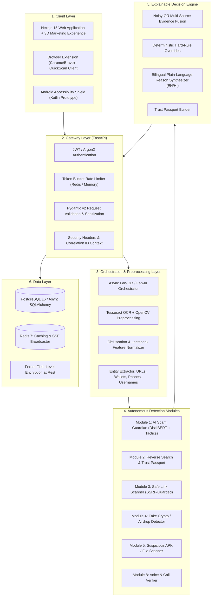

# ScamShield AI — System Architecture Specification

## 1. High-Level Architectural Model

ScamShield AI follows a clean, decoupled, layered event-driven architecture designed to analyze heterogeneous threat vectors with zero cross-module coupling.

## 2. Request Lifecycle & Asynchronous Execution Sequence

1. **Submission:** User submits text, chat screenshot, URL, phone number, wallet, or APK.
2. **Gateway Ingestion:** Request is assigned a unique `X-Correlation-ID`, rate limits are checked, and validation occurs via Pydantic.
3. **Preprocessing:**
   - If image: OpenCV applies adaptive thresholding, bilateral filtering; Tesseract extracts text.
   - Text cleaner detects and normalizes obfuscations (`w.h.a.t.s.a.p.p`, emojis, zero-width chars) while retaining obfuscation as an indicator feature.
   - Regex & checksum extractors parse URLs, E.164 phone numbers, and crypto addresses (EIP-55, Base58Check, Bech32).
4. **Concurrent Fan-Out:** Orchestrator dispatches tasks to applicable modules concurrently using `asyncio.gather(return_exceptions=True)`.
5. **Partial Streaming:** Results are streamed to the client via Server-Sent Events (`GET /api/v1/scans/{id}/stream`).
6. **Evidence Fusion:** Module findings feed into the Noisy-OR compounding formula. Hard rules override if severe threats (confirmed phishing, seed-phrase demands) are identified.
7. **Trust Passport Emission:** Structured JSON containing score, level, word-level highlight spans, indicators, and emergency actions (1930 / cybercrime.gov.in) is returned.

## 3. Module Decoupling Rule
Detection modules **never** invoke each other directly. All inter-module communication is coordinated strictly through the Orchestrator, ensuring that every module can be unit-tested and benchmarked in total isolation.
